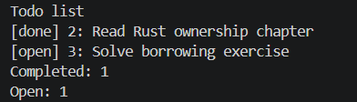
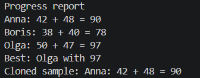

---


# Лабораторная работа №2
# Rust: владение, ссылки, traits и generics

**Студент:** Санянц Анета, ИВТ-1.1

---

## Задача 2.1. Список дел и владение данными

### Код программы (src/main.rs)

```rust
#[derive(Debug, PartialEq, Eq)]
struct Task {
    id: u32,
    title: String,
    completed: bool,
}

impl Task {
    fn new(id: u32, title: String) -> Self {
        Self {
            id,
            title,
            completed: false,
        }
    }

    fn mark_completed(&mut self) {
        self.completed = true;
    }

    fn status_label(&self) -> &'static str {
        if self.completed {
            "done"
        } else {
            "open"
        }
    }
}

fn add_task(tasks: &mut Vec<Task>, id: u32, title: String) {
    tasks.push(Task::new(id, title));
}

fn complete_task(tasks: &mut [Task], id: u32) -> bool {
    if let Some(task) = tasks.iter_mut().find(|task| task.id == id) {
        task.mark_completed();
        true
    } else {
        false
    }
}

fn remove_task(tasks: &mut Vec<Task>, id: u32) -> bool {
    if let Some(position) = tasks.iter().position(|task| task.id == id) {
        tasks.remove(position);
        true
    } else {
        false
    }
}

fn count_completed(tasks: &[Task]) -> usize {
    tasks.iter().filter(|task| task.completed).count()
}

fn count_open(tasks: &[Task]) -> usize {
    tasks.len() - count_completed(tasks)
}

fn format_tasks(tasks: &[Task]) -> String {
    tasks
        .iter()
        .map(|task| format!("[{}] {}: {}", task.status_label(), task.id, task.title))
        .collect::<Vec<_>>()
        .join("\n")
}

fn main() {
    let mut tasks = Vec::new();

    add_task(&mut tasks, 1, String::from("Create Cargo project"));
    add_task(&mut tasks, 2, String::from("Read Rust ownership chapter"));
    add_task(&mut tasks, 3, String::from("Solve borrowing exercise"));

    complete_task(&mut tasks, 2);
    remove_task(&mut tasks, 1);

    println!("Todo list");
    println!("{}", format_tasks(&tasks));
    println!("Completed: {}", count_completed(&tasks));
    println!("Open: {}", count_open(&tasks));
}

#[cfg(test)]
mod tests {
    use super::*;

    #[test]
    fn adds_task_by_taking_title_ownership() {
        let mut tasks = Vec::new();
        let title = String::from("Learn ownership");
        add_task(&mut tasks, 1, title);
        assert_eq!(tasks.len(), 1);
        assert_eq!(tasks[0].title, "Learn ownership");
    }

    #[test]
    fn completes_existing_task_through_mutable_slice() {
        let mut tasks = vec![
            Task::new(1, String::from("A")),
            Task::new(2, String::from("B")),
        ];
        assert!(complete_task(&mut tasks, 2));
        assert!(tasks[1].completed);
        assert_eq!(count_completed(&tasks), 1);
    }

    #[test]
    fn removes_task_from_vector() {
        let mut tasks = vec![
            Task::new(1, String::from("A")),
            Task::new(2, String::from("B")),
        ];
        assert!(remove_task(&mut tasks, 1));
        assert_eq!(tasks.len(), 1);
        assert_eq!(tasks[0].id, 2);
    }
}
```

### Cargo.toml

```toml
[package]
name = "task01_todo_ownership"
version = "0.1.0"
edition = "2024"

[dependencies]
```

### Результат выполнения



---

### Проверка форматирования и тестов

```bash
$ cargo fmt
$ cargo test
    Finished `test` profile [unoptimized + debuginfo] target(s) in 0.xxs
     Running unittests src/main.rs (target/debug/deps/task01_todo_ownership-xxx)

running 3 tests
test tests::adds_task_by_taking_title_ownership ... ok
test tests::completes_existing_task_through_mutable_slice ... ok
test tests::removes_task_from_vector ... ok

test result: ok. 3 passed; 0 failed; 0 ignored; 0 measured; 0 filtered out; finished in 0.00s
```

---

## Задача 2.2. Traits, generics и учебный отчёт

### Код программы (src/main.rs)

```rust
#[derive(Clone, Debug, PartialEq, Eq)]
struct Pair<T> {
    left: T,
    right: T,
}

impl<T> Pair<T> {
    fn new(left: T, right: T) -> Self {
        Self { left, right }
    }

    fn left(&self) -> &T {
        &self.left
    }

    fn right(&self) -> &T {
        &self.right
    }
}

impl Pair<u32> {
    fn sum(&self) -> u32 {
        self.left + self.right
    }
}

trait ReportLine {
    fn report_line(&self) -> String;
}

#[derive(Clone, Debug, PartialEq, Eq)]
struct StudentResult {
    name: String,
    scores: Pair<u32>,
}

impl StudentResult {
    fn new(name: &str, first_score: u32, second_score: u32) -> Self {
        Self {
            name: name.to_string(),
            scores: Pair::new(first_score, second_score),
        }
    }

    fn total(&self) -> u32 {
        self.scores.sum()
    }
}

impl ReportLine for StudentResult {
    fn report_line(&self) -> String {
        format!(
            "{}: {} + {} = {}",
            self.name,
            self.scores.left(),
            self.scores.right(),
            self.total()
        )
    }
}

fn build_report<T: ReportLine>(items: &[T]) -> String {
    items
        .iter()
        .map(|item| item.report_line())
        .collect::<Vec<_>>()
        .join("\n")
}

fn best_result(items: &[StudentResult]) -> Option<&StudentResult> {
    items.iter().max_by_key(|item| item.total())
}

fn main() {
    let results = vec![
        StudentResult::new("Anna", 42, 48),
        StudentResult::new("Boris", 38, 40),
        StudentResult::new("Olga", 50, 47),
    ];

    println!("Progress report");
    println!("{}", build_report(&results));

    if let Some(best) = best_result(&results) {
        println!("Best: {} with {}", best.name, best.total());
    }

    let copied_sample = results[0].clone();
    println!("Cloned sample: {}", copied_sample.report_line());
}

#[cfg(test)]
mod tests {
    use super::*;

    #[test]
    fn pair_stores_two_values() {
        let pair = Pair::new(10, 15);
        assert_eq!(*pair.left(), 10);
        assert_eq!(*pair.right(), 15);
        assert_eq!(pair.sum(), 25);
    }

    #[test]
    fn report_line_contains_total_score() {
        let result = StudentResult::new("Anna", 42, 48);
        assert_eq!(result.report_line(), "Anna: 42 + 48 = 90");
    }

    #[test]
    fn generic_report_collects_lines() {
        let results = vec![
            StudentResult::new("Anna", 42, 48),
            StudentResult::new("Boris", 38, 40),
        ];
        let report = build_report(&results);
        assert!(report.contains("Anna: 42 + 48 = 90"));
        assert!(report.contains("Boris: 38 + 40 = 78"));
    }

    #[test]
    fn finds_best_result() {
        let results = vec![
            StudentResult::new("Anna", 42, 48),
            StudentResult::new("Olga", 50, 47),
        ];
        let best = best_result(&results).expect("sample list is not empty");
        assert_eq!(best.name, "Olga");
        assert_eq!(best.total(), 97);
    }
}
```

### Cargo.toml

```toml
[package]
name = "task02_traits_generics_report"
version = "0.1.0"
edition = "2024"

[dependencies]
```

### Результат выполнения



---

### Проверка форматирования и тестов

```bash
$ cargo fmt
$ cargo test
    Finished `test` profile [unoptimized + debuginfo] target(s) in 0.xxs
     Running unittests src/main.rs (target/debug/deps/task02_traits_generics_report-xxx)

running 4 tests
test tests::pair_stores_two_values ... ok
test tests::report_line_contains_total_score ... ok
test tests::generic_report_collects_lines ... ok
test tests::finds_best_result ... ok

test result: ok. 4 passed; 0 failed; 0 ignored; 0 measured; 0 filtered out; finished in 0.00s
```

---

## Информация о студенте

**Анета Санянц, 1 курс, группа ИВТ-1.1**
```
